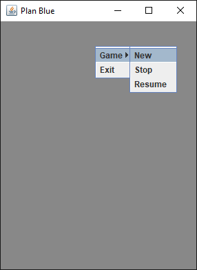
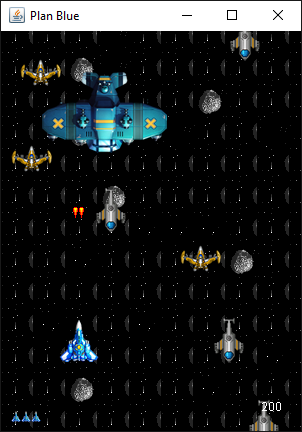

# PlanBlue

Not only I have managed to read a whole book, but also to
complete a kind of playable sort of game. The book is called
"Java Games Design Patterns", and it is based on *Swing*
library, which is not the best choice becoz I guess it's not
thread safety, for example the game on Linux has some frame-cut
issues that was unable to solve. Nevertheless the book gives
practical hands on experience which is really valuable, also 
after completing the code, you'll have no problems building
GUI in java, and it gives a basic gaming knowledge that can help 
you if you want to move to some more serious gaming environment
like *libGDX* or whatever. If you want to learn design patterns,
probably have to look for something else:) anyway the entry
point is the PlanBlue.java main function and the game logic,
so to speak is in Canvas.java, to compile and run the program,
type:

```shell
javac -d bin com/planblue/*.java
java -cp bin com.planblue.PlanBlue
```


you start by right clicking, and then selecting red or blue plane



then moving with the arrow keys and firing with the space bar:)
it's not very interesting, so in general one should start building
the game from here, but again the game is just for learning purposes,
Thanks for the knowledge